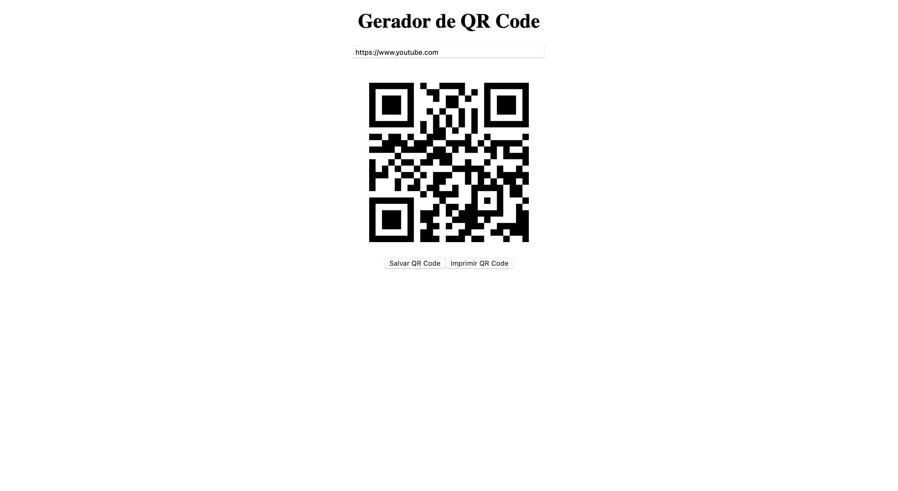

 <h1>Inova QR</h1> 
Projeto desenvolvido para facilitar a criação de QR Codes personalizados. O Inova QR permite gerar códigos para diversos tipos de conteúdo, como links, textos, contatos e muito mais.
 

<h4>  ·    ·    ·   </h4> 

## :notebook_with_decorative_cover: Menu

## :camera: Screenshots

  

## :dart: Funcionalidades
Geração de QR Codes para URLs.
Personalização de cores e formatos dos QR Codes.
Download dos códigos em formatos PNG e SVG.
Interface intuitiva e responsiva.

## :compass: Roadmap

 ## 🔧 Feito por:

<table> <tr> <td align="center"> <a href="https://github.com/viktor-ariel">    <b>Viktor Ariel</b> </a> </td> <!-- Adicione outros membros da equipe aqui --> </tr> </table>

## :handshake: Contato

Viktor Ariel - viktorariel777@gmail.com

Link do projeto: [Inova QR](https://github.com/viktor-ariel/inova-qr/)

LinkedIn: [Viktor Ariel](https://www.linkedin.com/in/viktor-ariel/)

